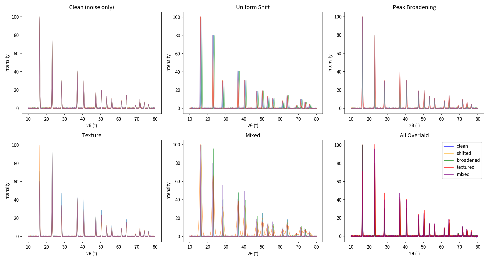

# XRD-VEC DB: Physics-Informed Data Augmentation Module

This repository contains the **physics-informed data augmentation module** for [XRD-VEC DB](https://github.com/xxx/xrd-vec-db), a million-scale structure-XRD paired database for geometric deep learning.

> **Paper**: *A Foundational Geometric Deep Learning Benchmark for Crystallographic Structure-Spectrum Alignment*  
> **Venue**: KDD 2026

## Overview

To bridge the domain gap between idealized computed XRD spectra and experimental measurements, we propose a **dual-augmentation framework** combining parametric transformations with molecular dynamics sampling.

| Strategy | Physical Basis | Speed | Use Case |
|----------|----------------|-------|----------|
| **Parametric** | Phenomenological parameters | O(N), milliseconds | Large-scale augmentation |
| **MD-based** | First-principles thermodynamics | O(N²), minutes | High-fidelity simulation |



## Parametric Augmentation (`noise/`)

Simulates experimental artifacts based on standard crystallographic settings (Cu Kα, λ = 1.5406 Å, 2θ = 10°–90°):

- **Peak Position Shifts**: Uniform shift (sample displacement, δ_max ≈ 0.5°) and non-uniform shift (lattice strain, ε_max ≤ 4%)
- **Peak Broadening**: Scherrer equation with domain size D ~ U(5, 100) nm
- **Preferred Orientation**: Texture factor with τ_max ∈ [0, 1]
- **Background & Noise**: Chebyshev polynomial background + Gaussian noise (σ ≈ 0.25)

**Pipeline**: Texture → Shift → Broadening → Background → Noise

## MD Augmentation (`mlmd/`)

Captures intrinsic thermal effects using MLIP-driven (CHGNet) molecular dynamics:

- **NVT-Langevin**: Stochastic heat bath coupling
- **NVT-Berendsen**: Weak-coupling thermostat
- **NPT-Berendsen**: Thermal expansion effects

Generates physically self-consistent spectra with Debye-Waller factors and lattice dynamics.

## Installation

```bash
# Core dependencies
pip install numpy scipy matplotlib pymatgen

# For MD augmentation (requires CUDA)
pip install ase chgnet
```

## Quick Start

### Parametric Augmentation

```python
from noise.xrd_augmentor import augment_xrd, XRDAugmentor, AugmentConfig

# One-line API with presets: 'mild', 'moderate', 'strong', 'experimental'
spectrum = augment_xrd(angles, intensities, preset='moderate')

# Custom configuration
config = AugmentConfig(noise_std=0.3, max_shift=0.5, max_texture=0.6)
aug = XRDAugmentor(config)
spectrum = aug.augment(angles, intensities, hkls=miller_indices)
```

### From CIF File

```bash
python noise/demo_cif_augmentation.py path/to/structure.cif
```

### MD Augmentation

```bash
python mlmd/md_xrd_augmentation.py  # Requires GPU
```

## Combined Pipeline

For maximum physical fidelity, combine both strategies:

```
Structure → MD Sampling → Thermal Snapshots → XRD Calculation → Parametric Augmentation
```

This yields N_s × N_p unique training samples grounded in physical reality.

## Project Structure

```
├── noise/                    # Parametric augmentation
│   ├── xrd_augmentor.py      # Unified augmentor class
│   ├── ceder_augmentation.py # Individual augmenters
│   └── demo_cif_augmentation.py
├── mlmd/                     # MD augmentation
│   └── md_xrd_augmentation.py
└── analysis/                 # Results and visualizations
    ├── plots/
    ├── structures/
    └── data/
```

## Citation

If you use this code, please cite:

```bibtex
@inproceedings{xrdvecdb2026,
  title={A Foundational Geometric Deep Learning Benchmark for Crystallographic Structure-Spectrum Alignment},
  author={Su, Tianhao and Hu, Rui and Wu, Yue and Wang, Yin and Li, Musen and Hu, Shunbo},
  booktitle={Proceedings of the 32nd ACM SIGKDD Conference on Knowledge Discovery and Data Mining},
  year={2026}
}
```

## References

1. Szymanski et al., "Probabilistic Deep Learning Approach to Automate the Interpretation of Multi-phase Diffraction Spectra," *Chem. Mater.*, 2021.
2. Deng et al., "CHGNet as a pretrained universal neural network potential for charge-informed atomistic modelling," *Nat. Mach. Intell.*, 2023.
3. Berendsen et al., "Molecular dynamics with coupling to an external bath," *J. Chem. Phys.*, 1984.
