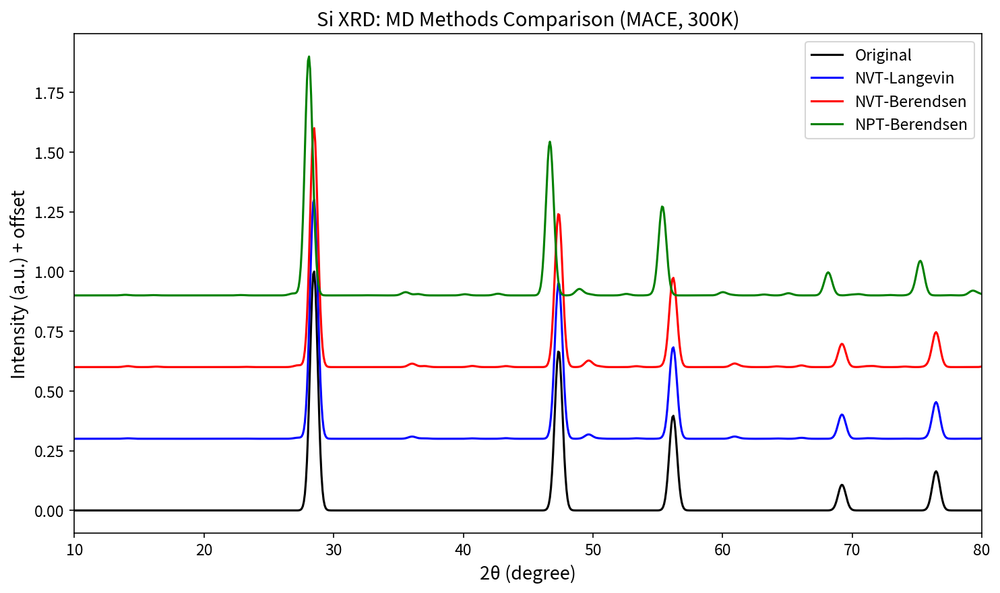
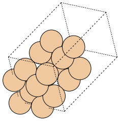
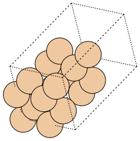
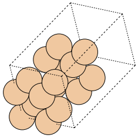
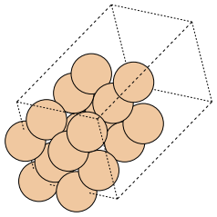
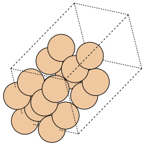
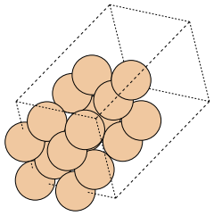

# Physics-Informed Data Augmentation for XRD Spectrum Analysis

## 3. Method

### 3.1 Overview

We propose a comprehensive physics-informed data augmentation framework for X-ray Diffraction (XRD) spectrum analysis in deep geometric learning. Our approach addresses the critical domain gap between simulated XRD patterns (computed from idealized crystal structures) and experimental measurements (affected by instrumental artifacts and thermal effects). The framework comprises two complementary strategies: (1) **Parametric Augmentation**—fast, empirically-parameterized transformations that simulate instrumental and sample-related artifacts; and (2) **Molecular Dynamics (MD) Augmentation**—physics-based sampling of thermally perturbed structures using Machine Learning Interatomic Potentials (MLIPs). These strategies can be applied independently or in combination, enabling flexible trade-offs between computational cost and physical fidelity.

### 3.2 Parametric Augmentation

#### 3.2.1 Peak Position Shifts

In experimental XRD measurements, peak positions deviate from theoretical values due to two primary mechanisms. *Uniform shift* arises from sample height displacement, causing all peaks to shift uniformly along the $2\theta$ axis:
$$\theta'_i = \theta_i + \Delta\theta, \quad \Delta\theta \sim \mathcal{U}(-\delta_{\max}, \delta_{\max})$$
where $\theta_i$ is the original peak position, $\theta'_i$ is the shifted position, and $\delta_{\max} \approx 0.5°$ for laboratory diffractometers. *Non-uniform shift* results from internal stress causing anisotropic lattice distortion:
$$d'_{hkl} = d_{hkl}(1 + \varepsilon_{hkl}), \quad \varepsilon \sim \mathcal{U}(-\varepsilon_{\max}, \varepsilon_{\max})$$
where $d_{hkl}$ is the interplanar spacing and $\varepsilon_{\max} \leq 4\%$.

#### 3.2.2 Peak Broadening (Scherrer Effect)

Finite crystallite size causes diffraction peak broadening according to the Scherrer equation:
$$\beta = \frac{K\lambda}{D \cos\theta}$$
where $\beta$ is the full-width at half-maximum (FWHM), $K \approx 0.9$ is the shape factor, $\lambda = 1.5406$ Å for Cu K$\alpha$, $D$ is the crystallite domain size (nm), and $\theta$ is the Bragg angle. We convolve each Bragg peak with an angle-dependent Gaussian kernel with $\sigma(\theta) = \beta(\theta) / (2\sqrt{2\ln 2})$. Domain sizes are sampled as $D \sim \mathcal{U}(D_{\min}, D_{\max})$ with typical range 5–100 nm.

#### 3.2.3 Preferred Orientation (Texture Effect)

In polycrystalline samples, crystallites may exhibit non-random orientation distributions. We simulate texture by scaling peak intensities based on alignment between Miller indices $(hkl)$ and a randomly sampled preferred direction $\mathbf{p}$:
$$I'_{hkl} = I_{hkl} \cdot f(hkl, \mathbf{p}), \quad f(hkl, \mathbf{p}) = (1 - \tau_{\max}) + \tau_{\max} \cdot |\cos\angle(hkl, \mathbf{p})|$$
where $\tau_{\max} \in [0, 1]$ (typically 0.6).

#### 3.2.4 Background and Noise

Experimental XRD patterns contain background contributions modeled using Chebyshev polynomials:
$$B(\theta) = \sum_{i=0}^{n} c_i \cdot T_i(\tilde{\theta}), \quad \tilde{\theta} = \frac{2(\theta - \theta_{\min})}{\theta_{\max} - \theta_{\min}} - 1$$
Noise is injected as $I_{\text{noisy}} = I + \varepsilon$ where $\varepsilon \sim \mathcal{N}(0, \sigma^2)$ with $\sigma \approx 0.25$.

#### 3.2.5 Augmentation Pipeline

The complete pipeline applies transformations sequentially: (1) Texture: $I'_i \leftarrow f(hkl_i, \mathbf{p}) \cdot I_i$; (2) Shift: $\theta'_i \leftarrow \theta_i + \Delta\theta$; (3) Broadening: $S(\theta) \leftarrow \sum_i I'_i \cdot G(\theta - \theta'_i; \sigma(\theta'_i, D))$; (4) Background: $S'(\theta) \leftarrow S(\theta) + B(\theta)$; (5) Noise: $S''(\theta) \leftarrow S'(\theta) + \varepsilon(\theta)$.

### 3.3 Molecular Dynamics Augmentation

#### 3.3.1 Machine Learning Interatomic Potentials

Traditional ab initio MD computes forces from DFT at each timestep with $O(N^3)$ scaling. MLIPs approximate the potential energy surface from DFT training data, enabling near-DFT accuracy at classical MD speeds. The total potential energy is modeled as $E = f_\theta(G(\mathbf{r}, Z))$, where $f_\theta$ is a neural network, $G$ is the crystal graph representation, $\mathbf{r} = \{\mathbf{r}_1, ..., \mathbf{r}_N\}$ are atomic positions, and $Z = \{Z_1, ..., Z_N\}$ are atomic numbers. Forces are obtained via $\mathbf{F}_i = -\partial E/\partial \mathbf{r}_i$.

#### 3.3.2 Thermodynamic Ensembles

The NVT (canonical) ensemble conserves particle number $N$, volume $V$, and temperature $T$, while energy $E$ and pressure $P$ fluctuate. The NPT (isothermal-isobaric) ensemble conserves $N$, $P$, $T$, while $E$ and $V$ fluctuate. The canonical probability distribution follows $P(E) \propto \exp(-E / k_B T)$.

**NVT-Langevin Dynamics.** The Langevin equation models coupling to a heat bath:
$$m_i \frac{d^2\mathbf{r}_i}{dt^2} = \mathbf{F}_i - \gamma m_i \frac{d\mathbf{r}_i}{dt} + \mathbf{R}_i(t)$$
where $\gamma$ is friction coefficient and $\mathbf{R}_i(t)$ is random force satisfying $\langle \mathbf{R}_i(t) \cdot \mathbf{R}_j(t') \rangle = 2\gamma m_i k_B T \delta_{ij} \delta(t - t')$.

**NVT-Berendsen Thermostat.** Velocities are rescaled via weak coupling: $dT/dt = (T_{\text{target}} - T) / \tau_T$.

**NPT-Berendsen Barostat.** Cell volume fluctuations follow $dP/dt = (P_{\text{target}} - P) / \tau_P$, capturing thermal expansion that affects XRD peak positions.

#### 3.3.3 XRD Pattern Calculation

For each MD snapshot, the structure factor is:
$$F_{hkl} = \sum_j f_j(s) \cdot \exp(2\pi i(hx_j + ky_j + lz_j)) \cdot \exp(-B_j s^2)$$
where $f_j(s)$ is atomic scattering factor, $s = \sin\theta/\lambda$, and $B_j$ is atomic displacement parameter. Diffracted intensity: $I_{hkl} = |F_{hkl}|^2 \cdot LP(\theta) \cdot m_{hkl}$. Experimental XRD averages over $\sim 10^{23}$ unit cells; we approximate by averaging $N_s$ MD snapshots: $I_{\text{avg}}(2\theta) = (1/N_s) \sum_{i=1}^{N_s} I_i(2\theta)$.

### 3.4 Comparison of Strategies

| Aspect | Parametric | MD-based |
|--------|------------|----------|
| Physical basis | Empirical parameters | First-principles thermodynamics |
| Computational cost | $O(N)$, milliseconds | $O(N^2)$, minutes–hours |
| Thermal effects | Approximated | Exact ensemble sampling |
| Lattice dynamics | Not captured | Naturally included |
| Use case | Large-scale augmentation | High-fidelity simulation |

The two approaches can be combined: Structure → MD Sampling → Thermal Snapshots → XRD Calculation → Parametric Augmentation → Final Spectrum.

---

## 4. Results

### 4.1 Experimental Setup

We demonstrate both augmentation strategies using silicon (Si) with diamond structure as a benchmark system.

| Parameter | Value |
|-----------|-------|
| Material | Si (Silicon) |
| Structure Type | Diamond (Fd-3m, No. 227) |
| Lattice Constant | $a = 5.43$ Å |
| X-ray Wavelength | Cu K$\alpha$ (1.5406 Å) |
| $2\theta$ Range | 10°–80° |
| Supercell (MD) | 2×2×2 (16 atoms) |

### 4.2 Parametric Augmentation Results

Figure 1 demonstrates five distinct transformation types applied to the ideal Si XRD pattern.

**Figure 1: Parametric Augmentation Effects on Si XRD Pattern.** Six subplots show: (1) *Clean*—baseline with Gaussian noise ($\sigma = 0.25$), showing characteristic Si peaks at $2\theta \approx 28.4°$, 47.3°, 56.1°, 69.1°, 76.4° for (111), (220), (311), (400), (331) reflections; (2) *Uniform Shift*—±0.5° random shifts; (3) *Peak Broadening*—Scherrer effect with domain sizes 5–50 nm; (4) *Texture*—preferred orientation with $\tau_{\max} = 0.6$; (5) *Mixed*—all effects combined; (6) *All Overlaid*—direct comparison.

### 4.3 MD Augmentation Results

MD simulations were performed using CHGNet as the MLIP at 300 K. Three thermodynamic ensembles were compared: NVT-Langevin, NVT-Berendsen, and NPT-Berendsen.

**Figure 2: XRD Patterns from Different MD Ensembles.** Overlay comparison with vertical offsets: *Original* (black)—ideal 0 K structure; *NVT-Langevin* (blue)—stochastic heat bath, intensities reduced by Debye-Waller effect; *NVT-Berendsen* (red)—weak-coupling thermostat; *NPT-Berendsen* (green)—thermal expansion causes peak shifts toward lower $2\theta$. NVT ensembles preserve peak positions while NPT captures lattice expansion.

### 4.4 Crystal Structure Visualization

Figure 3 shows a 3×3 grid of MD snapshots corresponding to the XRD patterns in Figure 2.

| | Snapshot 0 | Snapshot 1 | Snapshot 2 |
|:--:|:--:|:--:|:--:|
| **NVT-Langevin** |  |  |  |
| **NVT-Berendsen** |  |  |  |
| **NPT-Berendsen** |  |  |  |

**Figure 3: MD Sampled Crystal Structures.** Each row corresponds to a thermodynamic ensemble (matching XRD curves in Figure 2); each column represents a sampling snapshot at 300 K. Row 1 (blue curve): thermal fluctuations with fixed volume. Row 2 (red curve): weak-coupling thermostat. Row 3 (green curve): volume fluctuations allow thermal expansion.

### 4.5 Key Findings

(1) **Parametric augmentation** provides fast, controllable transformations suitable for large-scale data augmentation. (2) **MD augmentation** captures genuine thermal physics including atomic displacements, Debye-Waller intensity reduction, and thermal expansion (NPT). (3) **Combined approach** recommended: use MD for high-fidelity thermal sampling, then apply parametric augmentation for instrumental artifacts. (4) **Computational trade-off**: parametric runs in milliseconds; MD requires minutes but provides physically accurate sampling.

---

## References

[1] Szymanski, N. J. et al. "Probabilistic Deep Learning Approach to Automate the Interpretation of Multi-phase Diffraction Spectra," *Chem. Mater.*, 2021.

[2] Scherrer, P. "Bestimmung der Größe und der inneren Struktur von Kolloidteilchen mittels Röntgenstrahlen," *Nachr. Ges. Wiss. Göttingen*, 1918.

[3] Deng, B. et al. "CHGNet as a pretrained universal neural network potential for charge-informed atomistic modelling," *Nat. Mach. Intell.*, 2023.

[4] Berendsen, H. J. C. et al. "Molecular dynamics with coupling to an external bath," *J. Chem. Phys.*, 1984.

[5] Warren, B. E. *X-ray Diffraction*, Dover, 1990.

[6] Allen, M. P. & Tildesley, D. J. *Computer Simulation of Liquids*, Oxford, 2017.
